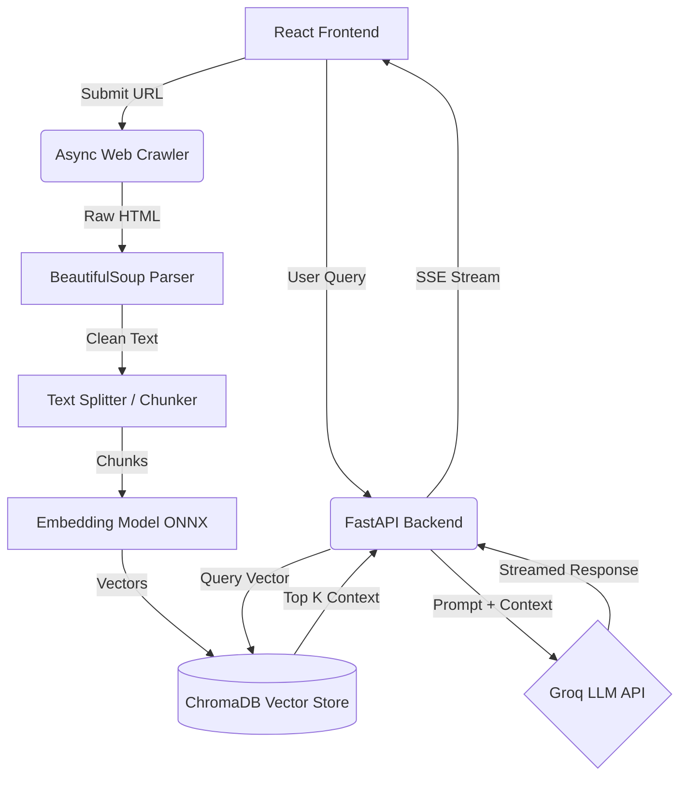
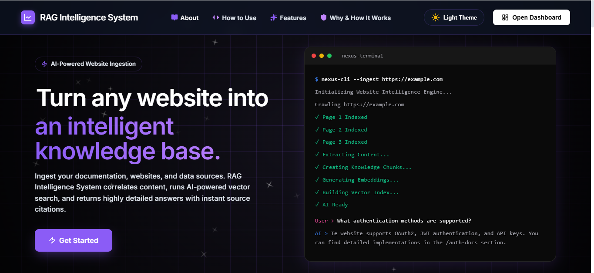
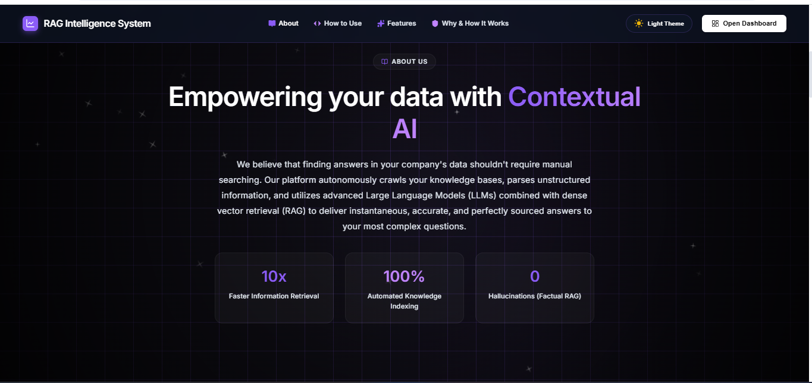
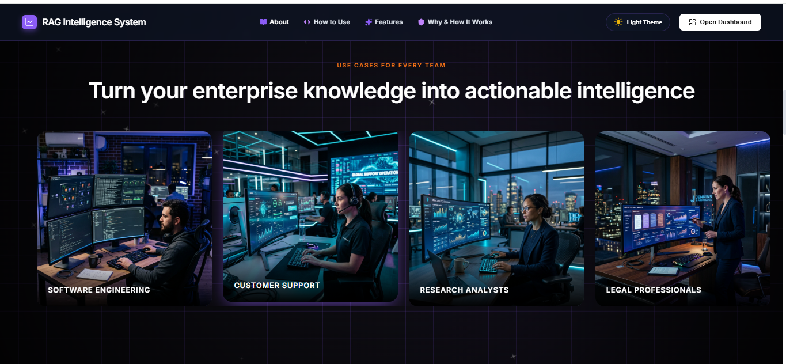
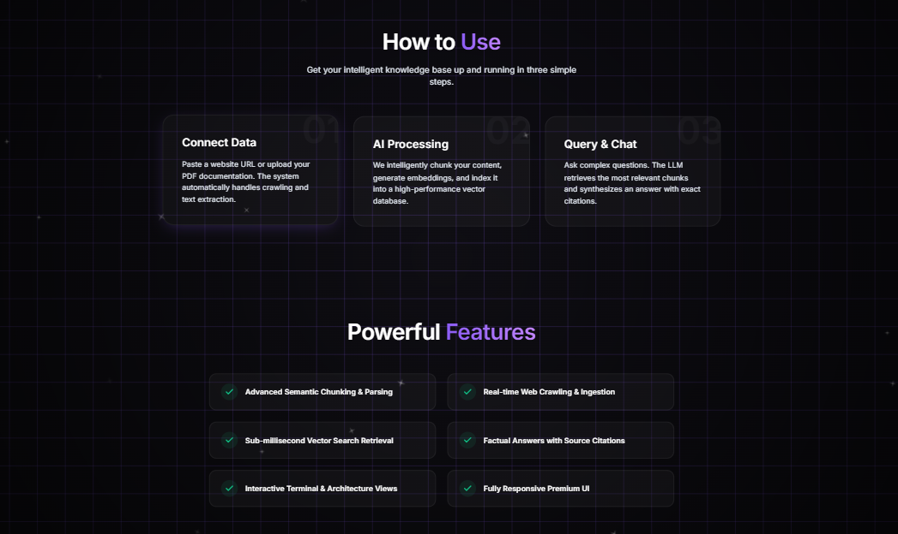
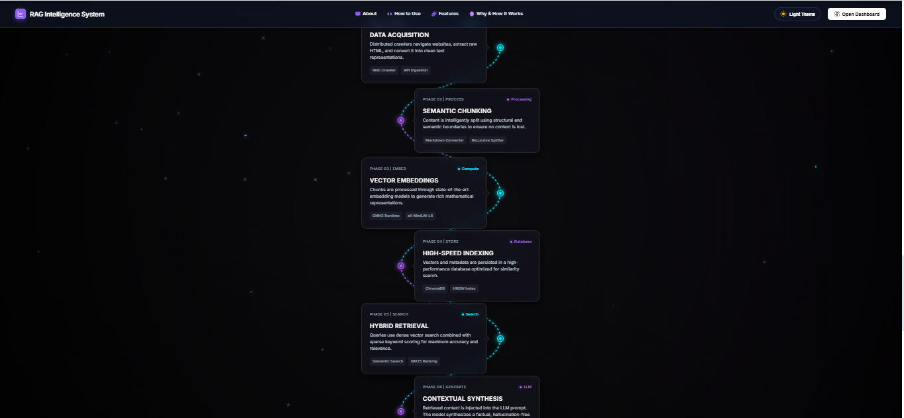
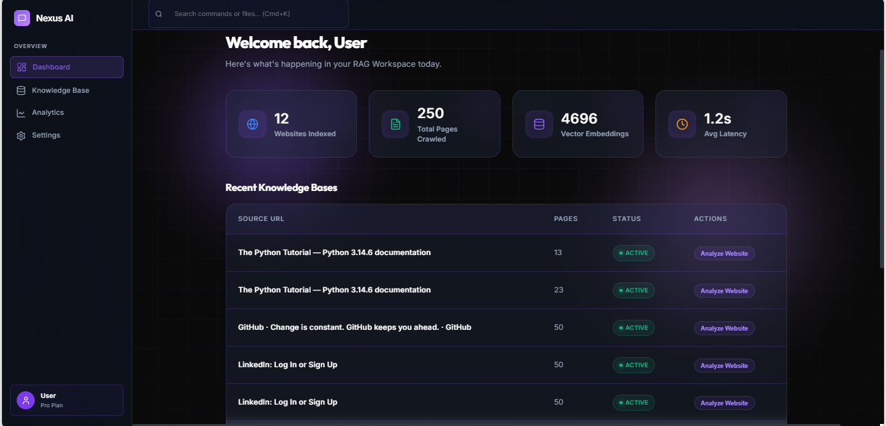
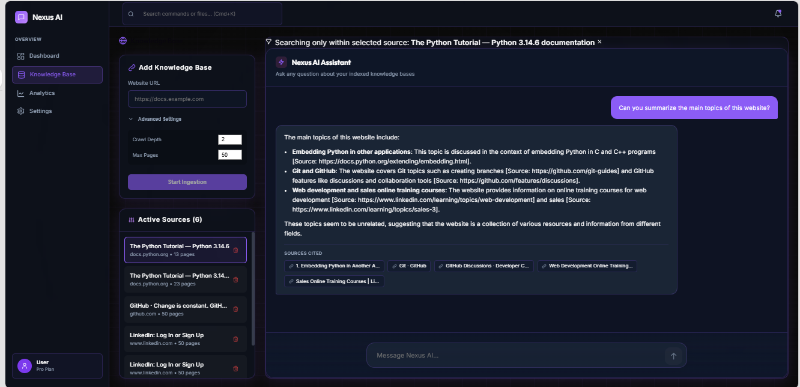
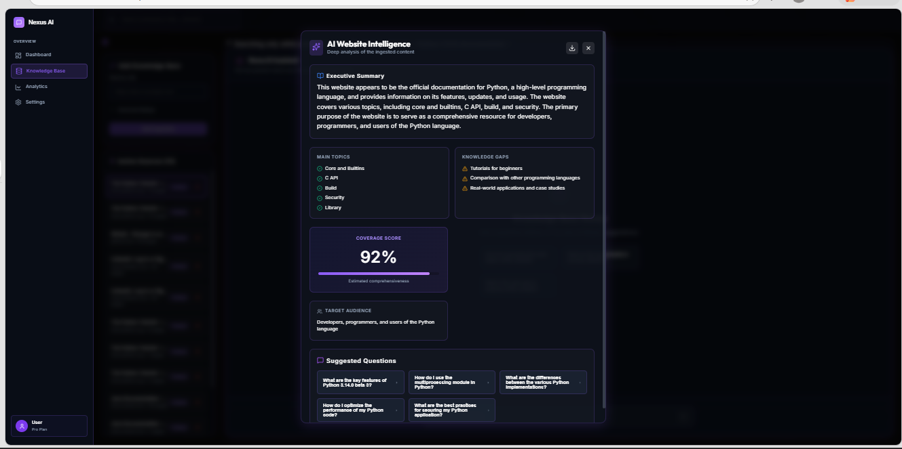
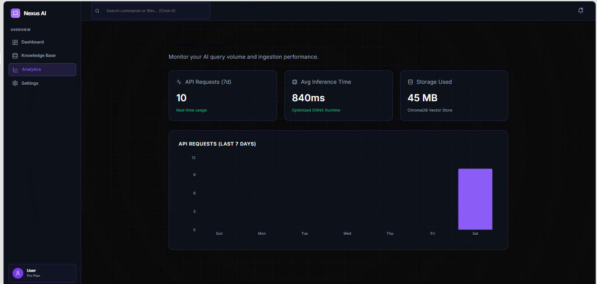

# 1. Project Title
Nexus AI — RAG Intelligence System

## 2. Description
Nexus AI is a highly scalable, full-stack chatbot application that leverages Retrieval-Augmented Generation (RAG) to provide hyper-accurate answers based on web content. It recursively scrapes any provided website, processes the text into vector embeddings, and uses a powerful Large Language Model to converse with the user while citing exact sources.

## 3. What I Made and What It Solves
**What I made:** A complete end-to-end RAG system with a stunning, responsive glassmorphism frontend and an asynchronous, high-performance Python backend.
**What it solves:** It solves the problem of LLM hallucinations and information retrieval by allowing users to dynamically build a trusted knowledge base from any website and query it in real-time. It turns unstructured web data into actionable, citable intelligence.

## 4. Detailed Tech Stack
- **React**: Used to build a dynamic, component-based user interface.
- **Vite**: Used as the lightning-fast build tool and development server for the frontend.
- **Framer Motion**: Used to create smooth, professional micro-interactions and page transitions.
- **Lucide React**: Used for beautiful, consistent iconography across the application.
- **FastAPI**: Used to build a robust, high-performance asynchronous backend API.
- **Uvicorn**: Used as the lightning-fast ASGI server to run the FastAPI backend.
- **Python (3.11+)**: Used as the core backend programming language for its rich AI ecosystem.
- **Groq (Llama-3.3-70b-versatile)**: Used as the core LLM engine for ultra-fast, high-quality text generation and website analysis.
- **ChromaDB**: Used as the local vector database to store and query text embeddings efficiently.
- **Sentence-Transformers (ONNX)**: Used built-in with ChromaDB to convert raw text chunks into mathematical vectors.
- **httpx, BeautifulSoup4 & lxml**: Used for ultra-fast, asynchronous, headless web scraping and high-performance HTML parsing without heavy browser overhead.

## 5. Links
- **Live Deployment:** [https://rag-woad.vercel.app/](https://rag-woad.vercel.app/)
- **Demo Video:** *(Link will be added here)*

## 6. Setup / Usage Instructions

### Backend Setup
```bash
cd backend
python -m venv venv
source venv/bin/activate  # On Windows use: venv\Scripts\activate
pip install -r requirements.txt
```
Create a `.env` file in the `backend` folder with your Groq API key:
```env
GROQ_API_KEY=your_groq_api_key_here
GROQ_MODEL=llama-3.3-70b-versatile
CHROMA_PERSIST_DIR=./chroma_data
MAX_CRAWL_DEPTH=2
MAX_PAGES=50
CHUNK_SIZE=1000
CHUNK_OVERLAP=200
TOP_K=5
CORS_ORIGINS=http://localhost:5173,http://localhost:3000,https://rag-woad.vercel.app
```
Start the backend server:
```bash
uvicorn app.main:app --reload --port 8000
```

### Frontend Setup
In a new terminal window:
```bash
cd frontend
npm install
npm run dev
```

## 7. Dependencies and Prerequisites
- **Node.js**: v18 or higher (for the frontend environment)
- **Python**: v3.11 or higher (for backend and AI operations)
- **Git**: For version control
- **Groq API Key**: Required for the LLM text generation

## 8. Step-by-Step Usage
1. Open the deployed application (or `http://localhost:5173` locally).
2. Click **"Open Dashboard"** from the landing page.
3. Navigate to the **"Knowledge Base"** tab.
4. Enter the URL of any website you wish to index and click ingest.
5. Wait a few moments as the system recursively crawls the site and generates embeddings.
6. Once completed, type your question into the chat interface.
7. Read the AI's response and click on the generated citation chips to verify the exact source page.

## 9. Solution Approach
- **Phase 1: Ingestion & Scraping:** Instead of using heavy browser automation, I utilized asynchronous HTTP requests (`httpx`), `BeautifulSoup`, and the high-speed `lxml` C-parser. This ensures the scraper is extremely fast and can easily run on serverless cloud platforms.
- **Phase 2: Chunking & Embedding:** The extracted raw text is intelligently split into overlapping chunks (1000 tokens) using Langchain to preserve context. These chunks are embedded using an ONNX-optimized embedding model and stored in ChromaDB.
- **Phase 3: Hybrid Retrieval & Analysis:** When a user asks a question, the query is vectorized and mathematically compared to the database. The top `K` most relevant chunks are retrieved along with a calculated **Confidence Score**. Users can also run a deep **AI Website Analysis** to generate an executive summary, identify knowledge gaps, and extract suggested questions.
- **Phase 4: Contextual Synthesis & Streaming:** The retrieved context is injected into a specialized prompt and sent to the Groq LLM. The LLM's response (including dynamic follow-up questions) is streamed back to the frontend token-by-token using Server-Sent Events (SSE) for a zero-latency feel.

## 10. Architecture Diagram


## 11. Explanation of Architecture
The architecture follows a classic decoupled client-server model optimized for AI workloads. The **React Frontend** handles all user interactions and maintains a persistent SSE connection for real-time text streaming. The **FastAPI Backend** acts as the orchestrator. When a URL is submitted, the **Async Web Crawler** fetches and cleans the data, which is then chunked and embedded into the **ChromaDB Vector Store**. During a chat, the backend vectorizes the user's query, fetches relevant context from ChromaDB, constructs a strict prompt, and passes it to the **Groq LLM**. The generated tokens are piped directly back to the frontend to minimize perceived latency.

## 12. Output Images / Screenshots

### Landing Page


### About Page


### Real Usage


### How and Features


### Timeline


### Dashboard


### Working


### AI Analysis Report


### Analytics


## 13. Future Enhancements
- **Multi-modal Support:** Allow users to upload PDFs, Word documents, and images directly into the knowledge base, alongside URLs.
- **Advanced Authentication:** Implement user accounts and OAuth to allow multiple users to maintain their own isolated vector databases and chat histories.
- **Cloud Vector Database:** Migrate from local ChromaDB to a managed cloud database like Pinecone or Weaviate to enable stateless backend deployments on platforms like Vercel or AWS Lambda.

## 14. Conclusion
Nexus AI successfully demonstrates how modern AI models and vector databases can be integrated into a sleek, performant web application. By utilizing an asynchronous Python backend, a blazingly fast LLM via Groq, and a responsive React frontend, this project delivers a highly functional RAG system capable of turning any unstructured website into an interactive, trustworthy knowledge source.
